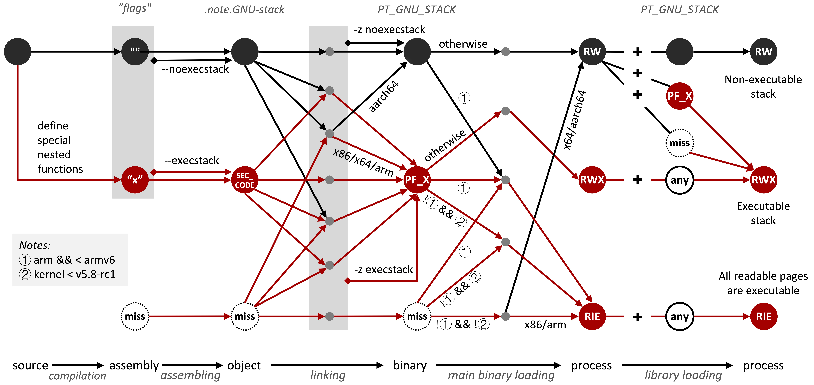

# BADASS

We have noticed multiple alarming cases where 
software developers accidentally disabled the W⊕X 
protection in their programs including popular 
applications such as [Electron](https://github.com/electron/electron/issues/11628), 
[VSCode](https://github.com/microsoft/vscode/issues/49793), 
and [CockroachDB](https://github.com/cockroachdb/cockroach/issues/37885).
These cases are unexpected since W⊕X is a mature technique
and should have been enabled automatically by default.

Our investigation revealed that W⊕X was disabled due to 
the inclusion of hand-written assembly files that missed 
a section directive: **.section .note.GNU-stack,"",@progbits**.
This directive declares a **.note.GNU-stack** section to 
indicate the stack should not be executable. Developers 
usually missed this directive and inadvertently made the
application stack executable when manually writing assembly 
code for various purposes. We term this problem BADASS.

## Investigating Security Tools

Even experienced security researchers 
and recognized developers may miss this directive when developing
security-hardening tools (e.g., inlined reference monitors). 
We conduct an investigation on the presence of BADASS issue in 
inlined reference monitors (IRM). 11 out of 21 investigated IRMs
have the BADASS issue and introduce executable stacks to hardened 
applications.

The following table lists all 21 investigated IRMs. We create a 
separate page for every IRM that suffers from BADASS issue. 
The page includes
instructions on how to reproduce this issue, a link to a virtual machine image for quick 
reproduction, the root cause analysis, and the timeline of the issue report and fix.

<table>
    <thead>
        <tr>
            <th>Category</th>
            <th>IRM</th>
            <th>Conference</th>
            <th>Assembly</th>
            <th>BADASS</th>
            <th>Status</th>
        </tr>
    </thead>
    <tbody>
        <tr>
            <td rowspan="8">CFI</td>
            <td>binCFI</td>
            <td>USENIX SEC'13</td>
            <td style="text-align:center">yes</td>
            <td style="text-align:center"><font color="#006600">no</font></td>
            <td style="text-align:center">-</td>
        </tr>
        <tr>
            <td><a href="mcfi_rockjit_picfi.md">MCFI</a></td>
            <td>PLDI'14</td>
            <td style="text-align:center">yes</td>
            <td style="text-align:center"><font color="#660000">yes</font></td>
            <td style="text-align:center">fixed</td>
        </tr>
        <tr>
            <td>LLVM CFI</td>
            <td>USENIX SEC'14</td>
            <td style="text-align:center">no</td>
            <td style="text-align:center"><font color="#006600">no</font></td>
            <td style="text-align:center">-</td>
        </tr>
        <tr>
            <td><a href="mcfi_rockjit_picfi.md">RockJIT</a></td>
            <td>CCS'14</td>
            <td style="text-align:center">yes</td>
            <td style="text-align:center"><font color="#660000">yes</font></td>
            <td style="text-align:center">fixed</td>
        </tr>
        <tr>
            <td><a href="mcfi_rockjit_picfi.md">πCFI</a></td>
            <td>CCS'15</td>
            <td style="text-align:center">yes</td>
            <td style="text-align:center"><font color="#660000">yes</font></td>
            <td style="text-align:center">fixed</td>
        </tr>
        <tr>
            <td><a href="patharmor.md">PathArmor</a></td>
            <td>CCS'15</td>
            <td style="text-align:center">yes</td>
            <td style="text-align:center"><font color="#660000">yes</font></td>
            <td style="text-align:center">won't fix</td>
        </tr>
        <tr>
            <td>μCFI</td>
            <td>CCS'18</td>
            <td style="text-align:center">yes</td>
            <td style="text-align:center"><font color="#006600">no</font></td>
            <td style="text-align:center">-</td>
        </tr>
        <tr>
            <td>Android kCFI</td>
            <td>-</td>
            <td style="text-align:center">no</td>
            <td style="text-align:center"><font color="#006600">no</font></td>
            <td style="text-align:center">-</td>
        </tr>
        <tr>
            <td>SFI</td>
            <td>Wasmtime</td>
            <td>-</td>
            <td style="text-align:center">no</td>
            <td style="text-align:center"><font color="#006600">no</font></td>
            <td style="text-align:center">-</td>
        </tr>
        <tr>
            <td>Debloating</td>
            <td>Razor</td>
            <td>USENIX SEC'19</td>
            <td style="text-align:center">yes</td>
            <td style="text-align:center"><font color="#006600">no</font></td>
            <td style="text-align:center">-</td>
        </tr>
        <tr>
            <td rowspan="2">Isolation</td>
            <td><a href="erim.md">ERIM</a></td>
            <td>USENIX SEC'19</td>
            <td style="text-align:center">yes</td>
            <td style="text-align:center"><font color="#660000">yes</font></td>
            <td style="text-align:center">fixed</td>
        </tr>
        <tr>
            <td><a href="donky.md">Donky</a></td>
            <td>USENIX SEC'20</td>
            <td style="text-align:center">yes</td>
            <td style="text-align:center"><font color="#660000">yes</font></td>
            <td style="text-align:center">no risk</td>
        </tr>
        <tr>
            <td rowspan="9">Binary Rewriting</td>
            <td><a href="uroboros.md">Uroboros</a></td>
            <td>USENIX SEC'15</td>
            <td style="text-align:center">yes</td>
            <td style="text-align:center"><font color="#660000">yes</font></td>
            <td style="text-align:center">checking</td>
        </tr> 
        <tr>
            <td><a href="ramblr.md">Ramblr</a></td>
            <td>NDSS'17</td>
            <td style="text-align:center">yes</td>
            <td style="text-align:center"><font color="#660000">yes</font></td>
            <td style="text-align:center">will fix</td>
        </tr>
        <tr>
            <td>Multiverse</td>
            <td>NDSS'18</td>
            <td style="text-align:center">no</td>
            <td style="text-align:center"><font color="#006600">no</font></td>
            <td style="text-align:center">-</td>
        </tr>
        <tr>
            <td>Egalito</td>
            <td>ASPLOS'20</td>
            <td style="text-align:center">no</td>
            <td style="text-align:center"><font color="#006600">no</font></td>
            <td style="text-align:center">-</td>
        </tr>             
        <tr>
            <td><a href="retrowrite.md">RetroWrite</a></td>
            <td>S&P'20</td>
            <td style="text-align:center">yes</td>
            <td style="text-align:center"><font color="#660000">yes</font></td>
            <td style="text-align:center">fixed</td>
        </tr>               
        <tr>
            <td>E9Patch</td>
            <td>PLDI'20</td>
            <td style="text-align:center">no</td>
            <td style="text-align:center"><font color="#006600">no</font></td>
            <td style="text-align:center">-</td>
        </tr>            
        <tr>
            <td><a href="ddisasm.md">Ddisasm <= 1.5.4</a></td>
            <td>USENIX SEC'20</td>
            <td style="text-align:center">yes</td>
            <td style="text-align:center"><font color="#660000">yes</font></td>
            <td style="text-align:center">fixed</td>
        </tr>            
        <tr>
            <td><a href="armore.md">ARMore</a></td>
            <td>USENIX SEC'23</td>
            <td style="text-align:center">yes</td>
            <td style="text-align:center"><font color="#660000">yes</font></td>
            <td style="text-align:center">fixed</td>
        </tr>            
        <tr>
            <td>SAFER</td>
            <td>USENIX SEC'23</td>
            <td style="text-align:center">yes</td>
            <td style="text-align:center"><font color="#006600">no</font></td>
            <td style="text-align:center">-</td>
        </tr>            
    </tbody>
</table>


## W⊕X Enforcement Analysis

We also conduct a systematic W⊕X enforcement analysis
by inspecting the source code of the 
compilation chain, the kernel, and the loader.
Based on the analysis, we summarize the complicated
logic related to stack executable permission in the 
following figure. The first row shows the normal 
compilation workflow where no BADASS exists. Red lines
demonstrate the potential locations where developers may
miss necessary attributes and introduce executable stacks.

<p align="left">

</p>

We summarize some error-prone scenarios that may disable W⊕X inadvertently.

1. Missing **.section .note.GNU-stack,"",@progbits** in hand-written assembly code
2. Define nested functions in source code.
3. Link an object with **SEC_CODE** set in **.note.GNU-stack**.
4. Load a shared library with **PF_X** set in **PT_GNU_STACK**.
5. Include object without **.note.GNU-stack** or binary without **PT_GNU_STACK** on 32-bit architecture.

Please check [our paper](https://huhong789.github.io/papers/ye:badass.pdf) published on NDSS 2025 for more details.

## Publication

```bib
Too Subtle to Notice: Investigating Executable Stack Issues in Linux Systems

@inproceedings{ye:badass,
  title        = {{Too Subtle to Notice: Investigating Executable Stack Issues in Linux Systems}},
  author       = {Hengkai Ye and Hong Hu},
  booktitle    = {Proceedings of the 32nd Network and Distributed System Security Symposium (NDSS 2025)},
  month        = {feb},
  year         = {2025},
  address      = {San Diego, CA},
}
```

## Acknowledgment

We appreciate the assistance of the IRM developers for their detailed
discussions and prompt resolution of reported issues. This research was
supported by National Science Foundation (NSF) under grants CNS-2247652 
and CNS-2339848.
